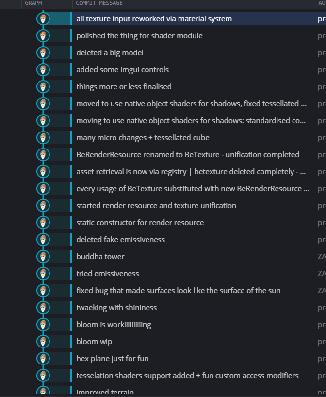
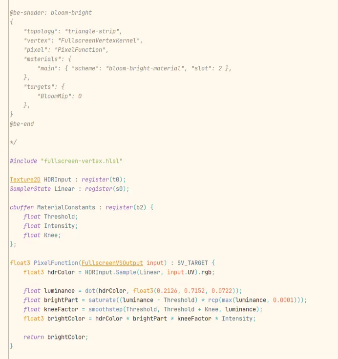

# yt-script-01

Title: i wanted to get a job in the industry, so i made a game engine

Title: i made a game engine to get a job in the industry

yo

im going to ask you one question:

how do you become cracked at graphical engineering?

this was the question i asked myself a few months ago.

my answer was: to make a game engine. and that’s exactly what i’ve done.

this is the story of my engine “be”:

**[ Cool Intro, Show-reel of moments, Self-control by Cursed Crown on background ]**

“be” is my personal C++ render engine made for maximum productivity and quality of work for render programmers and technical artists.

Currently it uses DirectX 11 with other backends coming at some point in the future.

Now, lets go all the way back to the beginning and talk about how it all started.

…

i have never really done engine development specifically. i did play with OpenGL at some point, i looked into bgfx [an api-layer that minecraft bedrock uses] and i also have a lot of experience with modern game engines like unity and unreal both in professional setting and in personal projects.

so i was familiar with some of the concepts at the moment i began writing the engine. and from my previous experience with game engines i had a few ideas of what i wanted to achieve with the engine.

see, the big pain point of mine in my previous experience was shader interaction and writing rendering code. i have never really used an environment in which writing those is easy. some of these enviroments are better than others, but using them has always been about doing some tricks or shenanigans or other hacks to bypass the limitations of either the system, the boundary or the engine itself. none of the workflows are nice. 

i am talking, for example, about unreal’s material graph or their hlsl. both are bad. good luck debugging and understanding this scratch for shaders and good luck searching information on how to look up a gbuffer texture in hlsl. On the latter, at the moment i was experiencing this issue i had to manually go over their shader code to find this lookup table, there was none of this info on the internet and the AIs cant answer this correctly by this day. 

this is the table and this is how to sample from it, take screenshots, because you won’t ever find this on the internet.

on the unity’s side, shaderlab is good overall, but the system as a whole has its limits. unity does have a cool thing called SRP, which stands for Scriptable Render Pipeline. however, i’ve never really used it, so i can’t say, but i’ve heard a lot of good about it and i’d like to try it in the future.

minor engines probably have even worse situation. wazzup to acerola improving godot shader experience.

[ clip from acerola’s video ]

yeah, for sure.

you could say: well, just go low level, use opengl, or dx11, or vulkan directly and you’ll have all the flexibility you want.

technically yes, but do you know how much boilerplate you have to write to just draw a screen-size quad? a lot. in any api. 

i guess my point here it obvious. none of the tech seem to prioritize render and shader programming experience and flexibility. 

don’t get me wrong, the current tech is powerful and good for its usage, it can handle huuuuge stuff, do great things, but none of it gives real freedom and tools for rendering. you’re always doing some kind of hacks, the only difference between them is the amount

and if go out on twitter and look for cool renders with unique approaches to doing stuff, it’s almost universally… three.js… like… what world do we live in, that to do some cool rendering, your go-to solution is javascript 💀💀💀 what???

that’s why, for the development of “be” i had two goals:

1. get cracked 🔥
2. make an engine that is both comfortable, flexible, and powerful to do rendering in. a tool that i can use for myself.

ok, i think we’re done yapping about metaphysical stuff and can actually start building.

well, first we need to open a window, i’m gonna use glfw for that. first we write glfwInit and then we open the window with glfw…

wait a second, no, i am sorry guys but there is just too much code to go over in this kind of passion. this just wont do well

i dont think the exact process matters this much, after all its all just: draw a triangle, add camera, draw a model, bla bla…

my approach to building the engine was iterative: first make something new with the tools we currently have, make the solution generic, then repeat with the next thing. 

For example: just draw a model somehow, then make a model abstraction to be able to draw many different models. Make it happen first, then make it good. First reach, then build a path.

every component of the engine was done in this manner. lets review them one by one.

the most important part of any engine, the actual workhorse of any renderer. shaders. shaders are the gpu-side programs that calculate your final colors that you see when playing any game.

in my engine i created my own semi-language for shaders on top of hlsl. it looks something like this:

in barebone api’s you usually have at least two files per one shader, because almost any shader has a vertex kernel and a pixel or a fragment kernel. these are usually separate, both called “main” and have separate files. this system is very annoying. shader languages in general are not really “done”, they’re just simple computational syntax. when you use them in their default version you usually carry a lot of implicit knowledge: what resource maps to what slot? what this shader outputs to? what IS this shader even. 

i like the way Unity solved this problem. they created their own shading language called ShaderLab that defines metadata for shader usage and then inside of this shaderlab you can write regular HLSL for the computation itself. I decided to use a similar system. now you write be-shader metadata in a comment somewhere in your file in json format and the engine builds the shader with all this explicit knowledge.

with this metadata, you can bundle all of your computation in a single shader file, list your kernels, materials you use and …

to be cont

- code-first, no main editor application
- for render/shader programmers
- minimal restrictions and\or assumptions